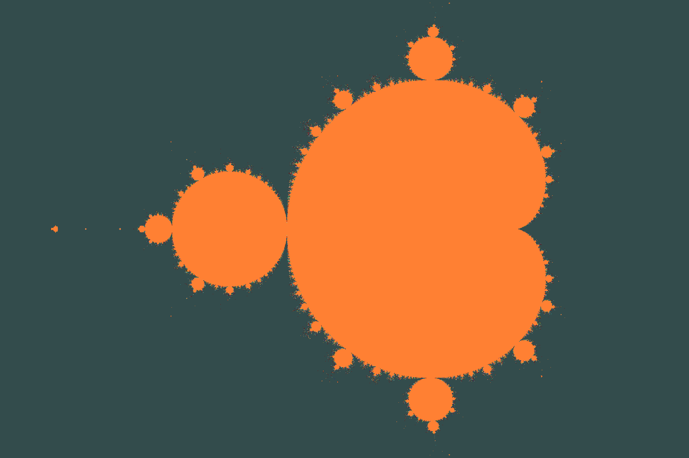
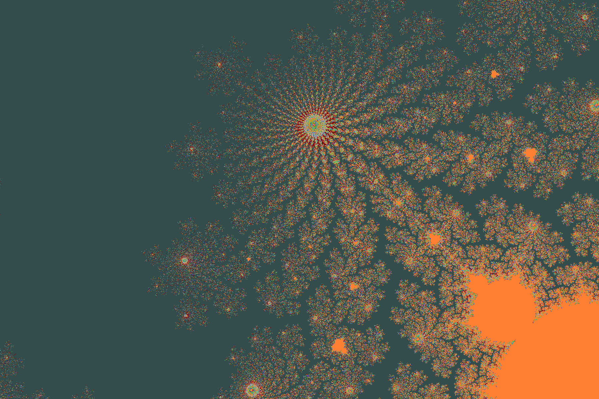

# Mandelbrot
An OpenGL program that creates the Mandelbrot set in GLSL.
Uses [Glutin](https://crates.io/crates/glutin)/[Winit](https://crates.io/crates/winit) for window management and [gl](https://crates.io/crates/gl) for function loading.

# Controls
* `A/D/S/W`: move around
* `Mousewheel`: zoom in/out
* `Up/Down`: set number of iterations (starting with 200, changes 10 steps at once)

The controls are currently quite messy when zoomed in.

# Examples

